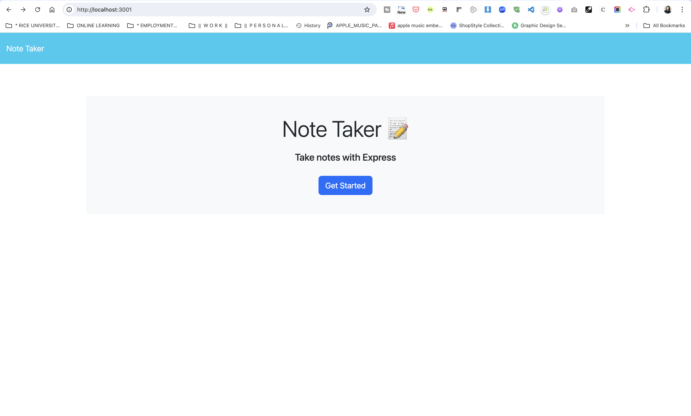
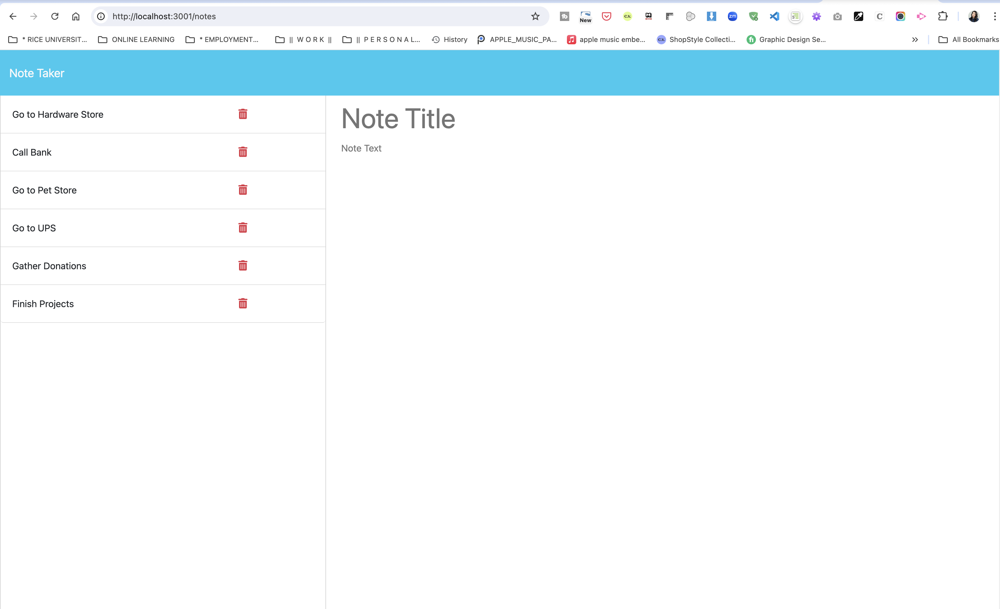

# Module 11 Challenge: Express.js Note Taker Application

## Description

- This application called Note Taker that can be used to write and save notes. This application uses an Express.js back end and will save and retrieve note data from a JSON file.

## Tasks Completed

-- Cloned starter code and pushed into a new repository in personal github account

-- Built backend server.js file and connected it to front end.

-- Installed UUID node.js package to assign unique IDs to each task

-- Created HTML routes and API routes

-- Added DELETE route which removes notes by assigned ID

-- Deployed application to Render:

--- <https://note-taker-app-g96i.onrender.com/>

## Installation

- clone the repo

- install npm using `npm i` in terminal

- install necessary dependency, UUID for uniqueID by typing `npm i UUID` in terminal

- run application using `node index.js`

## Usage

## Credits

\*\* This project was accomplished with the help provided by the instructors and TAs of the Rice University Coding Bootcamp, including Instructor Darian Mendez, Mateo Wallace, Mark Alfano, Gerard Mennella

Starter code was used to begin this project, which can be found at:

- <https://github.com/coding-boot-camp/miniature-eureka>

References:

- <https://www.geeksforgeeks.org/how-to-generate-unique-id-with-node-js/>

- <https://developer.mozilla.org/en-US/docs/Learn/Server-side/Express_Nodejs/routes>

  ## License

- LicenseDistributed under the MIT License. See LICENSE.txt for more information.
